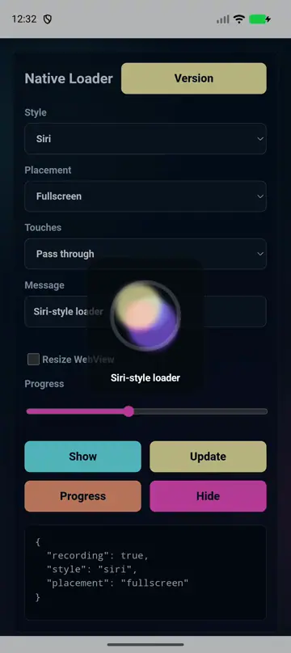
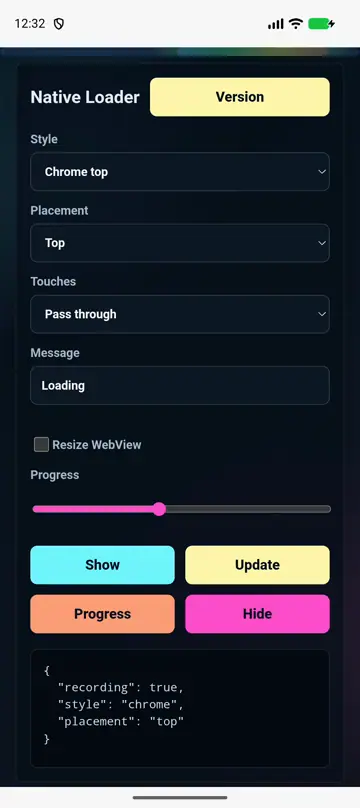
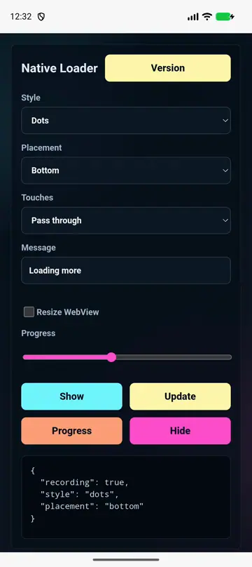
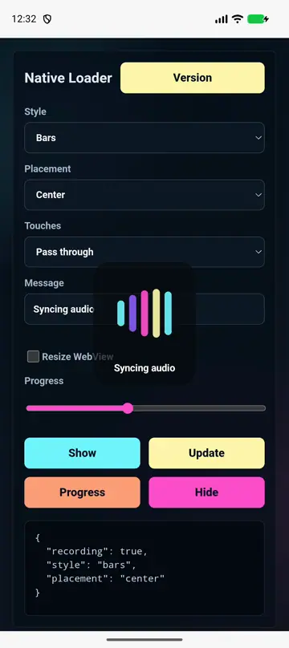
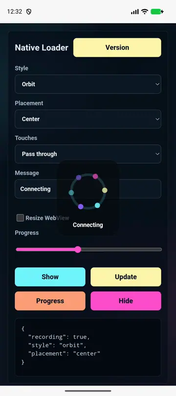
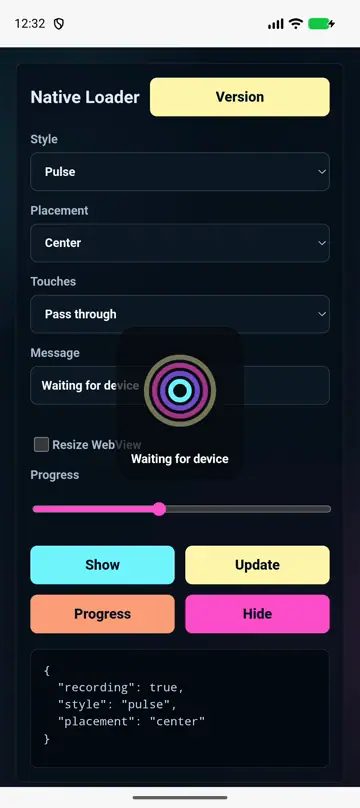
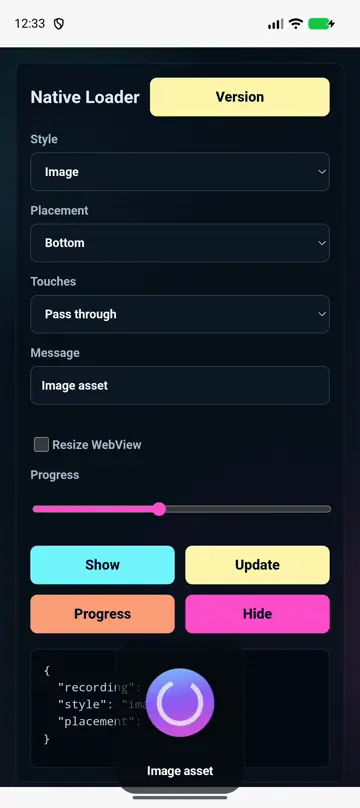

# @capgo/capacitor-native-loader

<a href="https://capgo.app/"></a>

<div align="center">
  <h2><a href="https://capgo.app/?ref=plugin_native_loader">Get Instant updates for your App with Capgo</a></h2>
  <h2><a href="https://capgo.app/consulting/?ref=plugin_native_loader">Missing a feature? We'll build the plugin for you</a></h2>
</div>

Native animated loaders for Capacitor apps. Render loaders above the WebView with platform-native SwiftUI, Android Canvas, Lottie, or image assets, while optionally resizing/insetting the WebView so native loading states can share space with web content.

## Features

- Native loader styles: `siri`, `chrome`, `orbit`, `ring`, `pulse`, `dots`, `bars`, `wave`, `halo`, and `around`.
- Asset loaders: native Lottie JSON and native image views from bundled assets, file URLs, remote URLs, or data URLs.
- Placements: center, top, bottom, left, right, fullscreen, around the screen, or custom frame.
- Transparent overlays with pass-through, blocking, or loader-only touch handling.
- WebView layout control: resize or inset the Capacitor WebView while a loader is visible, then restore it on hide.
- Public native API: call `NativeLoader.shared` from Swift or `NativeLoader.show(...)` from Kotlin/Java plugins without going through JavaScript.
- Reduced-motion aware native animations.

## Preview

| Loader | Demo | Loader | Demo |
| ------ | ---- | ------ | ---- |
| Siri |  | Chrome top |  |
| Ring |  | Dots |  |
| Bars |  | Wave |  |
| Orbit |  | Pulse |  |
| Halo |  | Around |  |
| Lottie |  | Image |  |

Regenerate previews with:

```bash
bun run previews
```

The preview clips are captured from the example app running in a real simulator/emulator and sliced into WebP demos.

## Install

```bash
npm install @capgo/capacitor-native-loader
npx cap sync
```

## Usage

```typescript
import { NativeLoader } from '@capgo/capacitor-native-loader';

const { id } = await NativeLoader.show({
  style: 'siri',
  placement: 'fullscreen',
  message: 'Preparing update',
  colors: ['#71f6ff', '#8b5cf6', '#ff4ecd', '#fff7ad'],
  scrimColor: 'rgba(3, 7, 18, 0.42)',
  interactionMode: 'block',
  accessibilityLabel: 'Preparing update',
});

await NativeLoader.hide({ id });
```

## WebView Resize

```typescript
const loader = await NativeLoader.show({
  style: 'bars',
  placement: 'bottom',
  message: 'Uploading',
  webView: {
    mode: 'resize',
    insets: { bottom: 96 },
    restoreOnHide: true,
  },
});

await NativeLoader.setProgress({ id: loader.id, progress: 0.72 });
await NativeLoader.hide({ id: loader.id });
```

## Chrome-Style Top Progress

```typescript
const loader = await NativeLoader.show({
  style: 'chrome',
  placement: 'top',
  colors: ['#4285f4', '#34a853', '#fbbc05', '#ea4335'],
  thickness: 4,
  interactionMode: 'passThrough',
  webView: {
    mode: 'resize',
    insets: { top: 12 },
    restoreOnHide: true,
  },
});

await NativeLoader.hide({ id: loader.id, restoreWebView: true });
```

## Lottie And Image Assets

```typescript
await NativeLoader.show({
  style: 'lottie',
  asset: {
    source: 'loader.json',
    type: 'lottie',
    loop: true,
    speed: 1,
  },
});

await NativeLoader.show({
  style: 'image',
  asset: {
    source: 'file:///var/mobile/Containers/Data/loader.webp',
    type: 'image',
  },
});
```

## Native Calls

Swift:

```swift
import NativeLoaderPlugin

let id = NativeLoader.shared.show(options: [
    "style": "halo",
    "placement": "top",
    "message": "Syncing"
])

NativeLoader.shared.hide(id: id)
```

Kotlin:

```kotlin
import app.capgo.nativeloader.NativeLoader

val id = NativeLoader.show(activity, mapOf(
    "style" to "orbit",
    "placement" to "bottom",
    "message" to "Syncing"
))

NativeLoader.hide(id)
```

## Compatibility

| Plugin version | Capacitor compatibility | Maintained |
| -------------- | ----------------------- | ---------- |
| v8.*.* | v8.*.* | Yes |
| v7.*.* | v7.*.* | On demand |
| v6.*.* | v6.*.* | On demand |

## Platform Notes

- iOS uses SwiftUI for built-in loaders and `lottie-spm` / `lottie-ios` for Lottie assets.
- Android uses custom Canvas views for built-in loaders and Airbnb Lottie for Lottie assets.
- Web has a CSS fallback for local demos and browser-based development.
- No permissions are required.

## Links

- Docs: https://capgo.app/docs/plugins/native-loader/
- Tutorial: https://capgo.app/plugins/capacitor-native-loader/
- Repository: https://github.com/Cap-go/capacitor-native-loader

## API

<docgen-index>

* [`configure(...)`](#configure)
* [`show(...)`](#show)
* [`update(...)`](#update)
* [`setProgress(...)`](#setprogress)
* [`hide(...)`](#hide)
* [`hideAll(...)`](#hideall)
* [`setWebViewLayout(...)`](#setwebviewlayout)
* [`resetWebViewLayout(...)`](#resetwebviewlayout)
* [`getState()`](#getstate)
* [`getPluginVersion()`](#getpluginversion)
* [Interfaces](#interfaces)
* [Type Aliases](#type-aliases)

</docgen-index>

<docgen-api>
<!--Update the source file JSDoc comments and rerun docgen to update the docs below-->

Native loader controller.

### configure(...)

```typescript
configure(options: NativeLoaderConfigureOptions) => Promise<void>
```

Configure defaults used by future `show` calls.

| Param         | Type                                                                                  |
| ------------- | ------------------------------------------------------------------------------------- |
| **`options`** | <code><a href="#nativeloaderconfigureoptions">NativeLoaderConfigureOptions</a></code> |

--------------------


### show(...)

```typescript
show(options?: NativeLoaderShowOptions | undefined) => Promise<NativeLoaderShowResult>
```

Show a native loader.

| Param         | Type                                                                        |
| ------------- | --------------------------------------------------------------------------- |
| **`options`** | <code><a href="#nativeloadershowoptions">NativeLoaderShowOptions</a></code> |

**Returns:** <code>Promise&lt;<a href="#nativeloadershowresult">NativeLoaderShowResult</a>&gt;</code>

--------------------


### update(...)

```typescript
update(options: NativeLoaderUpdateOptions) => Promise<void>
```

Update an existing native loader.

| Param         | Type                                                                            |
| ------------- | ------------------------------------------------------------------------------- |
| **`options`** | <code><a href="#nativeloaderupdateoptions">NativeLoaderUpdateOptions</a></code> |

--------------------


### setProgress(...)

```typescript
setProgress(options: NativeLoaderProgressOptions) => Promise<void>
```

Update determinate progress for a visible loader.

| Param         | Type                                                                                |
| ------------- | ----------------------------------------------------------------------------------- |
| **`options`** | <code><a href="#nativeloaderprogressoptions">NativeLoaderProgressOptions</a></code> |

--------------------


### hide(...)

```typescript
hide(options?: NativeLoaderHideOptions | undefined) => Promise<void>
```

Hide one loader.

| Param         | Type                                                                        |
| ------------- | --------------------------------------------------------------------------- |
| **`options`** | <code><a href="#nativeloaderhideoptions">NativeLoaderHideOptions</a></code> |

--------------------


### hideAll(...)

```typescript
hideAll(options?: NativeLoaderHideOptions | undefined) => Promise<void>
```

Hide every visible loader.

| Param         | Type                                                                        |
| ------------- | --------------------------------------------------------------------------- |
| **`options`** | <code><a href="#nativeloaderhideoptions">NativeLoaderHideOptions</a></code> |

--------------------


### setWebViewLayout(...)

```typescript
setWebViewLayout(options: NativeLoaderWebViewLayout) => Promise<void>
```

Apply a native WebView layout change without showing a loader.

| Param         | Type                                                                            |
| ------------- | ------------------------------------------------------------------------------- |
| **`options`** | <code><a href="#nativeloaderwebviewlayout">NativeLoaderWebViewLayout</a></code> |

--------------------


### resetWebViewLayout(...)

```typescript
resetWebViewLayout(options?: { animated?: boolean | undefined; } | undefined) => Promise<void>
```

Restore the WebView layout captured before `setWebViewLayout` or `show`.

| Param         | Type                                 |
| ------------- | ------------------------------------ |
| **`options`** | <code>{ animated?: boolean; }</code> |

--------------------


### getState()

```typescript
getState() => Promise<NativeLoaderStateResult>
```

Read current loader state.

**Returns:** <code>Promise&lt;<a href="#nativeloaderstateresult">NativeLoaderStateResult</a>&gt;</code>

--------------------


### getPluginVersion()

```typescript
getPluginVersion() => Promise<PluginVersionResult>
```

Returns the platform implementation version marker.

**Returns:** <code>Promise&lt;<a href="#pluginversionresult">PluginVersionResult</a>&gt;</code>

--------------------


### Interfaces


#### NativeLoaderConfigureOptions

Global defaults applied to future `show` calls.

| Prop           | Type                                                                        | Description           |
| -------------- | --------------------------------------------------------------------------- | --------------------- |
| **`defaults`** | <code><a href="#nativeloadershowoptions">NativeLoaderShowOptions</a></code> | Default show options. |


#### NativeLoaderShowOptions

Loader display options.

| Prop                     | Type                                                                                    | Description                                                                           |
| ------------------------ | --------------------------------------------------------------------------------------- | ------------------------------------------------------------------------------------- |
| **`id`**                 | <code>string</code>                                                                     | Stable loader id. A generated id is returned when omitted.                            |
| **`style`**              | <code><a href="#nativeloaderstyle">NativeLoaderStyle</a></code>                         | Built-in style or asset renderer. Defaults to `siri`.                                 |
| **`placement`**          | <code><a href="#nativeloaderplacement">NativeLoaderPlacement</a></code>                 | Native window placement. Defaults to `center`.                                        |
| **`frame`**              | <code><a href="#nativeloaderframe">NativeLoaderFrame</a></code>                         | Custom frame used when `placement` is `custom`.                                       |
| **`message`**            | <code>string</code>                                                                     | Optional loading message shown below or near the loader.                              |
| **`size`**               | <code>number</code>                                                                     | Loader size in points / CSS pixels. Defaults to `96`.                                 |
| **`thickness`**          | <code>number</code>                                                                     | Thickness for ring, edge, and progress loaders. Defaults to `5`.                      |
| **`duration`**           | <code>number</code>                                                                     | Animation duration in milliseconds for one cycle. Defaults vary by style.             |
| **`speed`**              | <code>number</code>                                                                     | Animation speed multiplier. Defaults to `1`.                                          |
| **`progress`**           | <code>number</code>                                                                     | Determinate progress from `0` to `1`. Omit for indeterminate loaders.                 |
| **`colors`**             | <code>string[]</code>                                                                   | Loader colors. Built-in loaders use the first colors as gradient stops.               |
| **`backgroundColor`**    | <code>string</code>                                                                     | Container background color.                                                           |
| **`scrimColor`**         | <code>string</code>                                                                     | Fullscreen scrim color. Used by `fullscreen` and `around` placements when set.        |
| **`cornerRadius`**       | <code>number</code>                                                                     | Corner radius for the floating container. Defaults to `24`.                           |
| **`blurRadius`**         | <code>number</code>                                                                     | Native blur radius where supported. Defaults to `0`.                                  |
| **`autoHide`**           | <code>number</code>                                                                     | Hide automatically after this many milliseconds.                                      |
| **`interactionMode`**    | <code><a href="#nativeloaderinteractionmode">NativeLoaderInteractionMode</a></code>     | Touch handling for the overlay. Defaults to `passThrough` unless `scrimColor` is set. |
| **`reducedMotion`**      | <code><a href="#nativeloaderreducedmotionmode">NativeLoaderReducedMotionMode</a></code> | Reduced motion behavior. Defaults to `system`.                                        |
| **`accessibilityLabel`** | <code>string</code>                                                                     | Accessibility label announced when the loader appears.                                |
| **`asset`**              | <code><a href="#nativeloaderasset">NativeLoaderAsset</a></code>                         | Asset configuration for `lottie` and `image` loaders.                                 |
| **`webView`**            | <code><a href="#nativeloaderwebviewlayout">NativeLoaderWebViewLayout</a></code>         | Optional native WebView layout mutation while the loader is visible.                  |


#### NativeLoaderFrame

Absolute frame in CSS pixels / device-independent points.

| Prop         | Type                | Description   |
| ------------ | ------------------- | ------------- |
| **`x`**      | <code>number</code> | Left offset.  |
| **`y`**      | <code>number</code> | Top offset.   |
| **`width`**  | <code>number</code> | Frame width.  |
| **`height`** | <code>number</code> | Frame height. |


#### NativeLoaderAsset

Native file, bundled asset, remote URL, or data URL used by `lottie` and `image` loaders.

| Prop           | Type                                                                    | Description                                                                                                                                                                                                                        |
| -------------- | ----------------------------------------------------------------------- | ---------------------------------------------------------------------------------------------------------------------------------------------------------------------------------------------------------------------------------- |
| **`source`**   | <code>string</code>                                                     | Asset path or URL. Supported forms: - app bundle asset name, for example `loader.json` - `file://` URL - `https://` or `http://` URL - `data:application/json;base64,...` for Lottie JSON - `data:image/...;base64,...` for images |
| **`type`**     | <code><a href="#nativeloaderassettype">NativeLoaderAssetType</a></code> | Explicit asset type. Defaults to the current loader `style`.                                                                                                                                                                       |
| **`loop`**     | <code>boolean</code>                                                    | Repeat asset animation. Defaults to `true`. Lottie assets loop their composition. Image assets loop their native rotation.                                                                                                         |
| **`speed`**    | <code>number</code>                                                     | Asset animation speed multiplier. Defaults to `1`. Applies to Lottie playback speed and image rotation speed.                                                                                                                      |
| **`autoPlay`** | <code>boolean</code>                                                    | Start asset animation immediately. Defaults to `true`. For image assets, this starts the native rotation loader.                                                                                                                   |


#### NativeLoaderWebViewLayout

Native WebView layout mutation.

| Prop                | Type                                                                        | Description                                                                                                                                                                       |
| ------------------- | --------------------------------------------------------------------------- | --------------------------------------------------------------------------------------------------------------------------------------------------------------------------------- |
| **`mode`**          | <code><a href="#nativeloaderwebviewmode">NativeLoaderWebViewMode</a></code> | Layout mode. `resize` changes the native WebView frame/margins. `inset` changes scroll content inset/padding where the platform supports it. `none` leaves the WebView untouched. |
| **`insets`**        | <code><a href="#nativeloaderinsets">NativeLoaderInsets</a></code>           | Insets applied in `resize` or `inset` mode.                                                                                                                                       |
| **`frame`**         | <code><a href="#nativeloaderframe">NativeLoaderFrame</a></code>             | Replace the WebView frame instead of using insets. Used only by iOS and by Android parents that support absolute layout params.                                                   |
| **`restoreOnHide`** | <code>boolean</code>                                                        | Restore the previous WebView layout when the loader is hidden. Defaults to `true`.                                                                                                |
| **`animated`**      | <code>boolean</code>                                                        | Animate the layout change where the platform supports it. Defaults to `true`.                                                                                                     |


#### NativeLoaderInsets

Insets in CSS pixels / device-independent points.

| Prop         | Type                | Description   |
| ------------ | ------------------- | ------------- |
| **`top`**    | <code>number</code> | Top inset.    |
| **`right`**  | <code>number</code> | Right inset.  |
| **`bottom`** | <code>number</code> | Bottom inset. |
| **`left`**   | <code>number</code> | Left inset.   |


#### NativeLoaderShowResult

Show result.

| Prop     | Type                | Description                                                         |
| -------- | ------------------- | ------------------------------------------------------------------- |
| **`id`** | <code>string</code> | Loader id that can be passed to `update`, `setProgress`, or `hide`. |


#### NativeLoaderUpdateOptions

Update an existing loader. Any omitted property keeps its current value.

| Prop     | Type                | Description          |
| -------- | ------------------- | -------------------- |
| **`id`** | <code>string</code> | Loader id to update. |


#### NativeLoaderProgressOptions

Progress update options.

| Prop           | Type                | Description                                                             |
| -------------- | ------------------- | ----------------------------------------------------------------------- |
| **`id`**       | <code>string</code> | Loader id. When omitted, the top-most/current loader receives progress. |
| **`progress`** | <code>number</code> | Determinate progress from `0` to `1`.                                   |


#### NativeLoaderHideOptions

Hide options.

| Prop                 | Type                 | Description                                                     |
| -------------------- | -------------------- | --------------------------------------------------------------- |
| **`id`**             | <code>string</code>  | Loader id. When omitted, the top-most/current loader is hidden. |
| **`animated`**       | <code>boolean</code> | Animate dismissal. Defaults to `true`.                          |
| **`restoreWebView`** | <code>boolean</code> | Restore WebView layout immediately. Defaults to `true`.         |


#### NativeLoaderStateResult

Current loader state.

| Prop          | Type                  | Description                               |
| ------------- | --------------------- | ----------------------------------------- |
| **`showing`** | <code>boolean</code>  | Whether at least one loader is visible.   |
| **`ids`**     | <code>string[]</code> | Visible loader ids from oldest to newest. |


#### PluginVersionResult

Plugin version payload.

| Prop          | Type                | Description                                                 |
| ------------- | ------------------- | ----------------------------------------------------------- |
| **`version`** | <code>string</code> | Version identifier returned by the platform implementation. |


### Type Aliases


#### NativeLoaderStyle

Built-in native loader renderer.

- `siri`: blurred, rotating multi-orb loader inspired by assistant listening UI.
- `chrome`: full-width top edge progress bar inspired by browser page loading UI.
- `orbit`: dots orbiting a transparent center.
- `ring`: rotating stroked ring.
- `pulse`: expanding translucent ripples.
- `dots`: three bouncing dots.
- `bars`: equalizer-style vertical bars.
- `wave`: flowing horizontal wave.
- `halo`: glowing radial halo.
- `lottie`: native Lottie JSON animation from `asset`.
- `image`: native image view from `asset`, rotating when `autoPlay` is enabled.

<code>'siri' | 'chrome' | 'orbit' | 'ring' | 'pulse' | 'dots' | 'bars' | 'wave' | 'halo' | 'lottie' | 'image'</code>


#### NativeLoaderPlacement

Where the loader is anchored in the native window.

<code>'center' | 'top' | 'bottom' | 'left' | 'right' | 'fullscreen' | 'around' | 'custom'</code>


#### NativeLoaderInteractionMode

How the native overlay handles pointer/touch input while the loader is visible.

<code>'passThrough' | 'block' | 'loaderOnly'</code>


#### NativeLoaderReducedMotionMode

How platform reduced-motion settings affect animated loaders.

<code>'system' | 'pause' | 'slow' | 'ignore'</code>


#### NativeLoaderAssetType

Loader asset type.

<code>'lottie' | 'image'</code>


#### NativeLoaderWebViewMode

How to alter the Capacitor WebView while a loader is visible.

<code>'none' | 'resize' | 'inset'</code>

</docgen-api>
